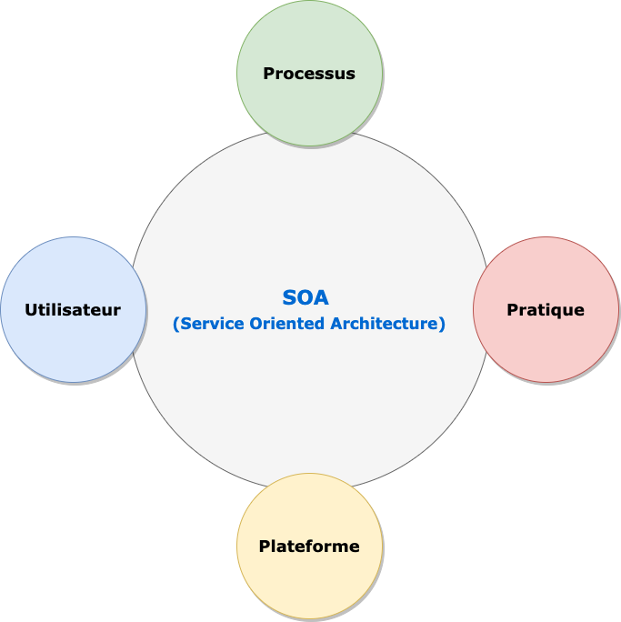
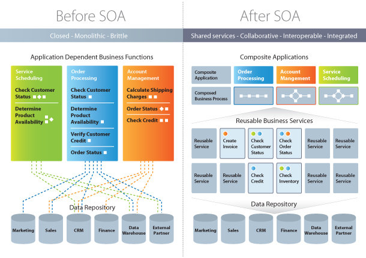

# Les concepts

Dans ce chapitre nous allons faire le tour des différents concepts qui entrent dans la compréhension de la conception orientée service. Il s'agira de définir la notion de **SOAD** (*Service Oriented Analysis and Design*), la définition du **SOA** (*Service Oriented Application*).

## Définition

L'analyse et la conception orientée services (**SOAD** : *Service Oriented Analysis and Design*) est une méthodologie qui fait référence à la modélisation et à la conception d'application d'architecture orientée services (**SOA**: *Service Oriented Application*). Une approche SOAD dans la conception SOA nécessite les éléments clés suivants:

-   **modèle de processus**
-   **instructions**
-   **normes**
-   **artefacts**
-   **qualité de service**

**Modèle de processus**: elle consiste en la définition du processus et de la notation en faisant un mélange de l'analyse orientée objet (**OOAD**), la modélisation des processus métier (**BPM**) et les éléments d'architecture d'entreprise.

**Instruction**: c'est la manière structurée de conceptualiser les services

**Normes** : fournir des facteurs de qualité bien définis et les meilleurs pratiques de service, de capacité, de données et de granularité des contraintes. Les rôles doivent être bien définis et indiquer si c'est un développeur, un architect ou un analyste qui est responsable de chaque fraction de travail.

**Artefacts**: elle consite à définir ce qui n'est pas un bon service, comme les services qui ne sont pas réutilisables, et qui ne sont donc pas considérés comme des résidents SOA.

**Qualité de service**: elle facilite la modélisation de bout en bout et fournit un support complet d'outils.

## Qu'est-ce-que la SOA

La **SOA** (\_Service Oriented Architecture) est un modèle de conception qui rend des composants logiciels réutilisables, grâce à des interfaces de services qui utilisent un langage commun pour communiquer via un réseau.

Un **service** est une unité autonome de fonctionnalité logicielle, ou d'un ensemble de fonctionnalités, conçue pour réaliser une tâche précise comme récupérer des informations ou exécuter une opération.

Il contient les intégrations de code et de données nécessaires pour exécuter une fonction métier distincte et complète. Vous pouvez y accéder à distance, et interagir avec lui ou le mettre à jour de manière indépendante. En d'autre termes, l'architecture SOA permet à des composants logiciels déployés et gérés séparement de communiquer et de fonctionner ensemble sous la forme d'applications logicielles communes à différents systèmes.

L'approche **SOA** intègre nativement les principes de *modularité*, d'*interfaçage*, de *contractualisation*, et d'*interopérabilité*. Elle assure ainsi une adaptation rapide du système d'informationn au regard des évolutions des besoins de l'entreprise. Elle permet également de capitaliser la mise en place de bonnes pratiques par l'élaboration d'une architecture de reference. Cette architecture de référence pourra également être utilisée pour répondre à des problématiques de convergence de systèmes.

```{r, out.width = "70%", fig.align='center', echo=FALSE}

```
L'architecture SOA se base sur ressources de l'entreprise pour fournir un système informatique efficient.

-   *Pratique* : elle utilise les best-practices de l'entreprise pour construire une architecture efficace
-   *Plateforme* : augmenter l'efficacité opérationnelle
-   *Utilisateur* : elle donne aux utilisateurs le pouvoir de prendre de meilleures décisions
-   *Processus* : aligner l'IT au processus métiers de l'entreprise

Selon le **Gartner Group Research**, une application qui obéit à la SOA doit respecter les cinq(5) principes suivants:

1.  *le système doit être modulaire*. Cela offre l'avantage évident de pouvoir diviser et régner (résoudre un problème complexe en assemblant un ensemble de petits composants simples qui fonctionnent ensemble)
2.  *les modules doivent être distribuables*. Ils doivent être capables de fonctionner sur des ordinateurs différents et communiquent entre eux en envoyant des messages sur un réseau lors de leur exécution.
3.  *les interfaces d'un module doivent être clairement définies et documentées*. Les développeurs de logiciels écrivent ou génèrent des métadonnées d'interface qui spécifient un contrat explicite afin qu'un autre développeur puisse trouver et utiliser le service (cela permet un couplage faible)
4.  *un module qui implémente un service peut être remplacé par un autre module qui offre le même service et la même interface*, car l'interface conçue est distincte du module. Il s'agit d'un aspect du couplage faible qui permet une maintenance et des améliorations continues.
5.  *les modules du fournisseur de services doivent être partageables*. Ils sont conçus et déployés de manière à pouvoir être invoqués successivement par des modules consommateurs de services disparates engagés dans des activités métiers diverses, bien que partiellement liées.


### Comment fonctionne l'architecture orientée service

Pour implémenter l'architecture orientée service (**SOA**) il existe une panoplie de technologies disponibles. Le choix technologique dépend du besoin de chaque entreprise. En général, une architecture orientée service utilise les services web pour son implémentation. Les services web sont une technologie qui permet de rendre les blocs fonctionnels accessibles à travers Internet. Parmi les possibilités de web service, nous avons l'implémentation du standard **SOAP** (*Simple Object Access Protocol*) , l'utilisation de l'architecture **REST** (*Representational State Transfer*). Il est également possible d'utiliser des technologies basées sur l'échange de message telle que **ActiveMQ**, **Apache ActiveMQ Artemis**, **Kafka**, etc. Les déveoppeurs peuvent également utiliser des modèles appelés **ESB** (*Enterprise Service Bus*) pour réaliser l'intégration entre unn composant centralisé et les systèmes backe-end, puis les rendre disponibles en tant qu'interfaces de services.

### SOA vs approche monolithique

Il existe plusieurs avantages à l'architecture orientée service spécialement pour un service web basé métier. Dans les lignes qui suivront, nous allons exposer quelques unes de ces bénéfices.

[Utiliser une architecture orientée service pour créer un code réutilisable]{.ul} : Non seulement cela réduit le temps consacré au processus de développement, mais il n'y a aucune raison de réinventer la roue de codage chaque fois que vous devez créer un nouveau service ou processus. L'architecture orientée services permet également d'utiliser plusieurs langages de codage car tout passe par une interface centrale.

[Utiliser une architecture orientée service pour promouvoir l'interaction]{.ul} : Avec l'architecture orientée services, une forme standard de communication est mise en place, permettant aux différents systèmes et plates-formes de fonctionner indépendamment les uns des autres. Grâce à cette interaction, l'architecture orientée services est également capable de contourner les pare-feu, permettant « aux entreprises de partager des services vitaux pour les opérations ».

[Utiliser une architecture orientée service pour la scalabilité]{.ul} : Il est important de pouvoir faire évoluer une entreprise pour répondre aux besoins du client, mais certaines dépendances peuvent entraver cette évolutivité. L'utilisation de l'architecture orientée services réduit l'interaction client-service, ce qui permet une plus grande évolutivité.

[Utiliser une architecture orientée service les coûts]{.ul} : Avec l'architecture orientée services, il est possible de réduire les coûts tout en « maintenant un niveau de sortie souhaité ». L'utilisation de l'architecture orientée services permet aux entreprises de limiter la quantité d'analyses requises lors du développement de solutions personnalisées.

```{r, out.width = "70%", fig.align='center', echo=FALSE}

```
### Les rôles au sein d'une architecture orientée service (SOA)

Trois (3) rôles fournissent les principaux composants d'une architecture orientée service : 

- le fournisseur de service
- le broker ou registre de service 
- le demandeur ou consommateur de service

__Fournisseur ou producteur__ : un fournisseur crée des services web qu'il met à la disposition dans un __registre de services__. Il est responsable des conditions d'utilisation de ces services.

__Broker ou registre de service__ : un borker ou registre de services est chargé de fournir les informations sur le service au __demandeur__. Le broker peut être public ou privé.

__Demandeur ou consommateur__ : le consommateur de services cherche un service dans un broker ou registre de services, puis se connecte à un __fournisseur de service__ pour obtenir le service en question.


```{r, out.width = "70%", fig.align='center', echo=FALSE}
knitr::include_graphics("roles.png")
```

### Les extensions de l'architecture SOA - Architecture évenementielle (Event-Driven Architecture)

Dans un système orienté événements, la structure centrale de la solution repose sur la capture, la communication, le traitement et la persistence des événements. C'est ce qui différencie ce type de système du modèle traditionnel orienté requête.

__Evénement__ : un événement désigne tout phénomène ou changement d'état significatif au niveau du matériel ou d'un logiciel système. Il ne faut pas confondre un événemet et une notification d'évenement, c'est-à-dire une notification ou un message envoyé par le système pour signaler à une autre partie du système qu'un événement s'est produit.
Les événements peuvent être causés par des actions internes ou externes. Ils peuvent être provoqués par des utilisateurs ( clics de souris ou frappe sur le clavier, par exemple), provenir d'une source externe (un capteur) ou être générés par le système (lors du chargement d'un programme, par exemple). 

Ce type d'architecture implique des __producteurs__ et des __consommateurs__ d'événements. Un producteur d'événements détecte ou reconnaît un événement et le représente sous forme de message. Il ignore quels seront les consommateurs et les conséquences de chaque événement.
Lorsqu'un évenement a été détecté, il est transmis du producteur au consommateur via des __canaux d'événement__, où une plateforme de traitemennt les prend en charge de façon asynchrone. Les consommateurs doivent être informés lorsqu'un événement se produit. Ils peuvent traiter l'événement ou être seulement affectés par ce dernier.
La plateforme de traitement des événements exécute ma reponse adaptée à chaque événement et envoie l'activité en aval au consommateurs concernés. Cette activité permet de visualiser le résultat d'un événement.


Une architecture orientée événements peut être basée sur un modèle de __publication/abonnement__ ou sur un modèle de __flux d'événements__ .

- le modèle de __publication/abonnement__ :  ce modèle est une infrastructure de messagerie basée sur des abonnements à flux d'événements. Lorsqu'il est utilisé, chaque fois qu'un événement se produit ou est publié, il est envoyé aux abonnés qui doivent en être informés.

- le modèle de __flux d'événement__ : avec ce modèle de flux d'événements, les évenements sont enregistrés dans un journal. Au lieu d'être abonnés à un flux d'évenements, les consommateurs peuvent accéder à n'importe quelle partie du flux et le rejoindre à tout moment.

### Les extensions de l'architecture SOA - Les API (Application Programming Interface)

Une __API__ ou __Interface de Programmation d'Application__, est un ensemble de définitions et de protocoles qui facilite la création et l'intégration de logiciel d'applications.
Les API permettent à votre produit ou service de communiquer avec d'autres produits et services sans connaître les détails de leur implémentation.
Les API sont parfois considérés comme des contrats avec une documentation qui constitue un accord entre les parties : si la __partie 1__ envoie une requête à distance selon une structure particulière, le logiciel de la __partie 2__ devra répondre selon les conditions définies. 

```{r, out.width = "70%", fig.align='center', echo=FALSE}
knitr::include_graphics("api.png")
```
Il existe plusieurs type d'API : les __API privées__ , les __API publiques__ et les __API partenaires__.

L'__API privée__ est utilisables qu'en interne de l'entreprise. Cette approche permet d'avoir un contrôle total sur l'API.

L'__API publique__ est accessible à tous. Cette approche autorise les tiers à développer des applications qui interagissent avec votre API et peut devenir source d'innovations.

L'__API partenaire__ est partagée avec certains partenaires de l'entreprise. Cette approche peut générer de nouveaux flux de revenus sans compromettre la sécurité.

### Les extensions de l'architecture SOA - Les microservices

Les __microservices__ sont une interprétation moderne des architectures orientées services utilisées pour créer des systèmes logiciels distribués. Ils ont une nouvelle approche de réalisation et de mise en oeuvre de la SOA qui met l'accent également sur le déploiement continu et d'autres pratiques agiles (__DevOps__).

Les architectures de microservices fonctionnent d'une manière très similaires à la SOA, dans le sens où elles utilisent des services faiblement couplés. Par contre, elles poussent la destructuration de l'architecture classique encore plus loin.

Les services qui compose l'architecture de microservices utilisent une structure de messagerie commune, telle que le __API RESTful__. Ils se servent des API RESTful pour communiquer entre eux simplement sans convertir leurs données ni recourir à des couches d'intégration supplémentaires. L'utilisation des API RESTful permet et favorise même l'accélération de la distribution es nouvelles fonctions et mises à jour.

Chaque service est distinct. Vous pouvez remplacer, améliorer ou supprimer chacun d'entre eux sans affecter les autres services de l'architecture. Cette architecture légère vous aide à optimiser les ressources distribuées ou Cloud et à faire évoluer chaque service de façon dynamique.

Les égalements ci-après caractérisent les microservices : 

- des interfaces fines (vers des services déployables indépendamment)

- développement axé sur les affaires ( par exemple, conception axée sur le domaine)

- architectures applicatives cloud

- programmation polyglotte et persistence

- déploiement de conteneurs légers

- livraison continue décentralisée

- DevOps avec une surveillance holistique des services.


```{r include=FALSE}
# automatically create a bib database for R packages
knitr::write_bib(c(
  .packages(), 'bookdown', 'knitr', 'rmarkdown'
), 'packages.bib')
```
